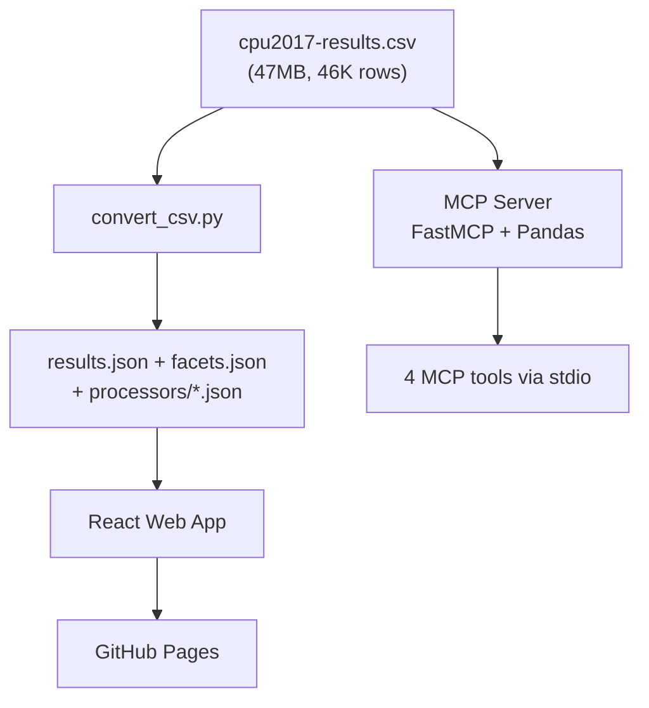

# spec-search

**SPEC CPU2017 Benchmark Explorer**

[](https://github.com/fjacquet/spec-search/actions/workflows/ci.yml)
[](https://fjacquet.github.io/spec-search/)
[](LICENSE)

Search, filter, and compare 46,000+ SPEC CPU2017 benchmark results through a web UI, an MCP server for AI assistants, or a static JSON API.

## Features

- **Web Application** — Filter by benchmark type, vendor, processor, core count, and scores. Sortable columns, pagination, and direct links to spec.org result pages.
- **MCP Server** — FastMCP-based tool server with `search_benchmarks`, `get_top_results`, `compare_processors`, and `get_statistics` tools for AI assistant integration.
- **Static JSON API** — Per-processor JSON files served on GitHub Pages for lightweight lookups (used by [cluster-sizer/Presizion](https://github.com/fjacquet/cluster-sizer)).

## Quick Start

### Prerequisites

- Python 3.12+ with [uv](https://docs.astral.sh/uv/)
- Node.js 22+

### Development

```bash
# Generate JSON data from CSV
make data

# Start web dev server
make serve

# Run MCP server
make mcp

# Run all tests
make test

# Run all linters
make lint
```

### MCP Server

Install and register the MCP server for Claude:

```bash
pip install "spec-search-mcp @ git+https://github.com/fjacquet/spec-search.git#subdirectory=mcp_server"
```

Add to your Claude config (`~/.claude.json` or Claude Desktop):

```json
{
  "mcpServers": {
    "spec-search": {
      "command": "uvx",
      "args": ["--from", "git+https://github.com/fjacquet/spec-search.git#subdirectory=mcp_server", "spec-search-mcp"]
    }
  }
}
```

## Architecture



## Tech Stack

| Component | Technology |
|-----------|-----------|
| Data pipeline | Python 3.12, csv stdlib |
| MCP server | FastMCP 3.x, Pandas |
| Web app | React 19, Vite 6 |
| Testing | Pytest, Vitest |
| Linting | Ruff (Python), Biome (JS) |
| CI/CD | GitHub Actions |
| Deployment | GitHub Pages |

## Data Source

Benchmark data sourced from [SPEC CPU2017 Published Results](https://www.spec.org/cpu2017/results/).

SPEC, SPECrate, and CPU2017 are trademarks of the [Standard Performance Evaluation Corporation (SPEC)](https://www.spec.org/). This project is not affiliated with or endorsed by SPEC. The data is used for informational and research purposes.

## License

MIT
