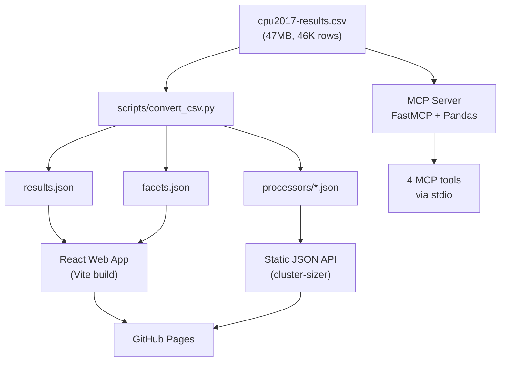

# Architecture

## Overview

spec-search is a three-component system: a data pipeline, a web application, and an MCP server. All three consume the same source CSV.

## Data Pipeline (`scripts/convert_csv.py`)

Reads the source CSV and produces three outputs:

1. **results.json** — Full dataset (46K records, 16 fields each) for the web search UI
2. **facets.json** — Unique values for dropdown filters (benchmarks, vendors, processors)
3. **processors/*.json** — One file per unique processor (623 files) for lightweight API lookups

The pipeline runs at build time (CI) and locally via `make data`. It uses only Python stdlib (csv, json).

## MCP Server (`mcp_server/`)

A standalone Python service using FastMCP 3.x that:
- Loads the CSV directly into a Pandas DataFrame (cached as singleton)
- Exposes 4 tools for search, ranking, comparison, and statistics
- Communicates via stdio transport

Runs locally alongside Claude Code or Claude Desktop.

## Web Application (`web/`)

A client-side React 19 app built with Vite 6:
- Fetches `results.json` and `facets.json` on page load
- Filters/sorts 46K rows in-browser using `Array.filter()` + `Array.sort()` (<50ms)
- Renders 50 rows per page with pagination
- Deployed as static files on GitHub Pages at `/spec-search/`

## Deployment

GitHub Actions CI workflow:
1. Lint (Ruff + Biome)
2. Test (Pytest + Vitest)
3. Build (convert CSV → JSON, then Vite build)
4. Deploy to GitHub Pages (on push to main only)
