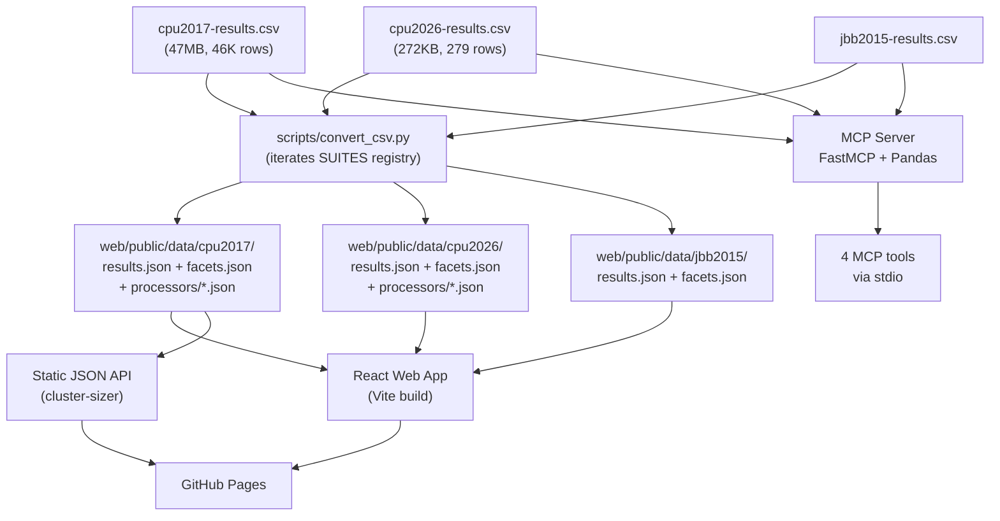

# Architecture

## Overview

spec-search is a three-component system: a data pipeline, a web application, and an MCP server. All three consume the same source CSV.


```mermaid
flowchart TD
    CSV17["cpu2017-results.csv\n(47MB, 46K rows)"]
    CSV26["cpu2026-results.csv\n(272KB, 279 rows)"]
    CSVJBB["jbb2015-results.csv"]

    CSV17 --> Pipeline["scripts/convert_csv.py\n(iterates SUITES registry)"]
    CSV26 --> Pipeline
    CSVJBB --> Pipeline
    CSV17 --> MCP["MCP Server\nFastMCP + Pandas"]
    CSV26 --> MCP
    CSVJBB --> MCP

    Pipeline --> results17["web/public/data/cpu2017/\nresults.json + facets.json\n+ processors/*.json"]
    Pipeline --> results26["web/public/data/cpu2026/\nresults.json + facets.json\n+ processors/*.json"]
    Pipeline --> resultsjbb["web/public/data/jbb2015/\nresults.json + facets.json"]

    results17 --> WebApp["React Web App\n(Vite build)"]
    results26 --> WebApp
    resultsjbb --> WebApp
    results17 --> API["Static JSON API\n(cluster-sizer)"]

    WebApp --> GHPages["GitHub Pages"]
    API --> GHPages

    MCP --> Tools["4 MCP tools\nvia stdio"]
```

## Data Pipeline (`scripts/convert_csv.py`)

The pipeline iterates a `SUITES` registry, producing one `web/public/data/<suite>/` output directory per suite. Currently three suites are registered: `cpu2017`, `cpu2026`, and `jbb2015`. CPU2017 is the default. CPU2026 additionally carries energy-efficiency metrics (`energyPeakResult`, `energyBaseResult`) and compiler/cache/storage enrichment fields; energy `0` values are normalized to `null` in the data layer.

Per suite, the pipeline produces three outputs:

1. **results.json** — Full dataset for the web search UI
2. **facets.json** — Unique values for dropdown filters (benchmarks, vendors, processors, and suite-specific facets such as `compilerCategories` for cpu2026)
3. **processors/*.json** — One file per unique processor for lightweight API lookups

The pipeline runs at build time (CI) and locally via `make data`. It uses only Python stdlib (csv, json).

## MCP Server (`mcp_server/`)

A pip-installable Python package (`spec-search-mcp`) using FastMCP 3.x:
- Loads CSV data from bundled gzip (2.5MB) or dev-mode repo path
- Exposes 4 tools for search, ranking, comparison, and statistics
- Communicates via stdio transport
- Entry point: `spec-search-mcp` command

Install from GitHub:
```bash
pip install "spec-search-mcp @ git+https://github.com/fjacquet/spec-search.git#subdirectory=mcp_server"
```

Package layout: `src/spec_search_mcp/` with hatchling build system.

## Web Application (`web/`)

A client-side React 19 app built with Vite 8:
- Fetches `results.json` and `facets.json` on page load
- Filters/sorts 46K rows in-browser using `Array.filter()` + `Array.sort()` (<50ms)
- Renders 50 rows per page with pagination
- Deployed as static files on GitHub Pages at `/spec-search/`

Web theming = Tailwind v4 `@theme` tokens (Midnight Executive), single source of truth mirrored to `web/src/theme/tokens.js` for charts + PPTX; see ADR-006.

Installable PWA via `vite-plugin-pwa` (Workbox `generateSW`, auto-update): the app shell is precached and benchmark `data/*.json` is runtime-cached `NetworkFirst` so the app works offline after first use; see ADR-007.

## Deployment

GitHub Actions CI workflow:
1. Lint (Ruff + Biome)
2. Test (Pytest + Vitest)
3. Build (convert CSV → JSON, then Vite build)
4. Deploy to GitHub Pages (on push to main only)
