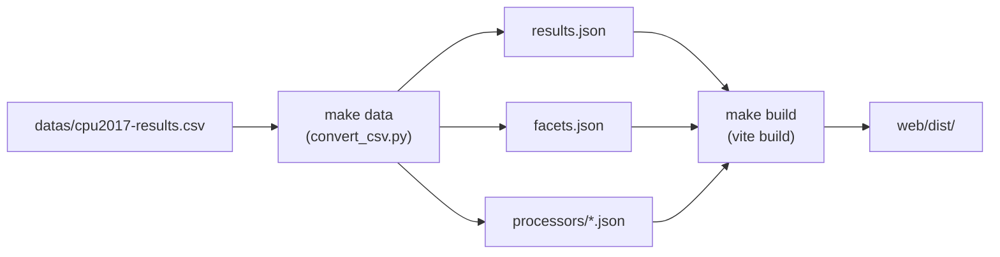

# Data Refresh Guide

How to update spec-search with the latest SPEC CPU2017 results from the official website.

## Data Source

SPEC publishes all CPU2017 benchmark results as a downloadable CSV:

**URL**: `https://www.spec.org/cgi-bin/osgresults?conf=cpu2017`

Click **"Dump All Records As CSV"** at the top of the page to download the full dataset (~47MB, ~46K rows).

## Refresh Steps

### 1. Download the CSV

Save the downloaded file to the project root, replacing the existing source:

```
datas/cpu2017-results.csv
```

### 2. Regenerate web app data and rebuild

```bash
make build
```

This runs two stages:



| Output | Location | Description |
|--------|----------|-------------|
| `results.json` | `web/public/data/` | Full dataset (16 fields per record) |
| `facets.json` | `web/public/data/` | Unique benchmarks, vendors, processors for filter dropdowns |
| `processors/*.json` | `web/public/data/processors/` | One file per processor for static API |
| `index.json` | `web/public/data/processors/` | Processor name → slug mapping |

### 3. Update the MCP server's bundled data

The MCP server ships its own gzipped copy of the CSV so it works standalone without the repo:

```bash
gzip -c datas/cpu2017-results.csv > mcp_server/src/spec_search_mcp/data/cpu2017-results.csv.gz
```

### 4. Verify

```bash
make test
```

This runs all test suites (pipeline, MCP server, web) to confirm nothing broke.

### 5. Commit

```bash
git add datas/cpu2017-results.csv mcp_server/src/spec_search_mcp/data/cpu2017-results.csv.gz
git commit -m "data: update SPEC CPU2017 results ($(date +%Y-%m-%d))"
```

> The generated JSON files in `web/public/data/` are gitignored — CI regenerates them from the CSV on deploy.

## Pipeline Details

`scripts/convert_csv.py` performs the following transformations:

1. **Column selection** — Maps 16 of 35 CSV columns to camelCase JSON keys
2. **Type coercion** — Parses numeric fields (cores, MHz, results) from strings
3. **URL extraction** — Pulls result detail URLs from the HTML `Disclosures` column
4. **Slugification** — Converts processor names to filesystem-safe slugs for per-processor files
5. **Deduplication** — Skips rows missing benchmark or processor fields

## Automation (CI/CD)

On push to `main`, the GitHub Actions workflow automatically:

1. Regenerates JSON from the committed CSV
2. Builds the Vite app
3. Deploys to GitHub Pages

No manual JSON generation is needed for production — just commit the updated CSV and push.
