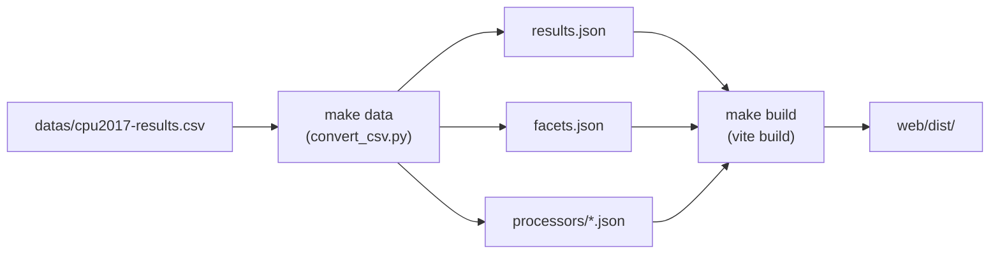

# Data Refresh Guide

How to update spec-search with the latest SPEC benchmark results from the official website.

## Data Source

SPEC publishes each suite's results as a downloadable CSV dump. Replace the
`conf=` value per suite:

| Suite | Dump URL | Saved to |
|-------|----------|----------|
| CPU2017 | `https://www.spec.org/cgi-bin/osgresults?conf=cpu2017` | `datas/cpu2017-results.csv` |
| CPU2026 | `https://www.spec.org/cgi-bin/osgresults?conf=cpu2026;op=dump;format=csvdump` | `datas/cpu2026-results.csv` |
| JBB2015 | `https://www.spec.org/cgi-bin/osgresults?conf=jbb2015` | `datas/jbb2015-results.csv` |

Click **"Dump All Records As CSV"** at the top of the page to download the full dataset.

## Refresh Steps

### 1. Download the CSV

Save the downloaded file to the project root using the filename from the table above:

```
datas/<suite>-results.csv
```

For example: `datas/cpu2017-results.csv`, `datas/cpu2026-results.csv`, or `datas/jbb2015-results.csv`.

### 2. Regenerate web app data and rebuild

```bash
make build
```

This runs two stages:


```mermaid
flowchart LR
    CSV["datas/cpu2017-results.csv"] --> Pipeline["make data\n(convert_csv.py)"]
    Pipeline --> R["results.json"]
    Pipeline --> F["facets.json"]
    Pipeline --> P["processors/*.json"]
    R --> Build["make build\n(vite build)"]
    F --> Build
    P --> Build
    Build --> Dist["web/dist/"]
```

| Output | Location | Description |
|--------|----------|-------------|
| `results.json` | `web/public/data/<suite>/` | Full dataset (fields vary by suite) |
| `facets.json` | `web/public/data/<suite>/` | Unique benchmarks, vendors, processors for filter dropdowns |
| `processors/*.json` | `web/public/data/<suite>/processors/` | One file per processor for static API |
| `index.json` | `web/public/data/<suite>/processors/` | Processor name → slug mapping |

### 3. Update the MCP server's bundled data

The MCP server ships its own gzipped copy of the CSV so it works standalone without the repo.

Run this for each suite whose CSV changed (swap `cpu2017` for `cpu2026` /
`jbb2015` as needed):

```bash
gzip -c datas/cpu2026-results.csv > mcp_server/src/spec_search_mcp/data/cpu2026-results.csv.gz
```

### 4. Verify

```bash
make test
```

This runs all test suites (pipeline, MCP server, web) to confirm nothing broke.

### 5. Commit

```bash
git add datas/cpu2017-results.csv mcp_server/src/spec_search_mcp/data/cpu2017-results.csv.gz
git commit -m "data: update SPEC CPU2017 results ($(date +%Y-%m-%d))"
```

> The generated JSON files in `web/public/data/` are gitignored — CI regenerates them from the CSV on deploy.

## Pipeline Details

`scripts/convert_csv.py` performs the following transformations:

1. **Column selection** — Maps 16 of 35 CSV columns to camelCase JSON keys
2. **Type coercion** — Parses numeric fields (cores, MHz, results) from strings
3. **URL extraction** — Pulls result detail URLs from the HTML `Disclosures` column
4. **Slugification** — Converts processor names to filesystem-safe slugs for per-processor files
5. **Deduplication** — Skips rows missing benchmark or processor fields

## Automation (CI/CD)

On push to `main`, the GitHub Actions workflow automatically:

1. Regenerates JSON from the committed CSV
2. Builds the Vite app
3. Deploys to GitHub Pages

No manual JSON generation is needed for production — just commit the updated CSV and push.
