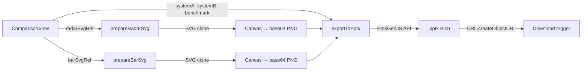

# PPTX Export for Comparison View

**Issue**: [#7 — Export PPTX](https://github.com/fjacquet/spec-search/issues/7)
**Date**: 2026-03-23
**Status**: Approved

## Problem

When comparing two processors in the web UI, users can export data as CSV, TSV, or chart PNGs individually. There is no way to get a single presentation-ready file that captures the complete comparison (charts + table) for sharing in meetings or reports.

## Decision Summary

| Decision | Choice |
|----------|--------|
| Slide count | Single slide |
| Chart rendering | Embedded PNG (reuse existing SVG→Canvas pipeline) |
| UI placement | Button in existing actions bar |
| Styling | Minimal white background |
| Library | PptxGenJS (client-side, ~250KB) |

## Slide Layout

Single 16:9 landscape slide with the following zones (top to bottom):

1. **Title bar** — Processor A name vs Processor B name, benchmark label (e.g. "Integer Multi-Core"), generation date. Separated by a thin blue (#0d6efd) horizontal line.

2. **Charts row** — Two images side by side:
   - Left: Radar chart PNG (from `prepareRadarSvg()` → Canvas → base64)
   - Right: Bar chart PNG (from `prepareBarSvg()` → Canvas → base64)

3. **Legend** — Color indicators: blue square = System A, red square = System B, with processor names.

4. **Comparison table** — 4 columns: Metric | System A | System B | Delta. Rows for all 14 comparison fields. Numeric deltas show percentage with green (#198754) for better, red (#dc3545) for worse. Alternating row shading for readability.

5. **Footer** — "Source: SPEC CPU®2017 Published Results — spec.org" right-aligned.

## Architecture

### New File

`web/src/components/exportPptx.js` — Pure function module (no React component). Exports a single function:

```javascript
export async function exportToPptx({ systemA, systemB, benchmark, radarSvgRef, barSvgRef })
```

### Dependencies

- **pptxgenjs** — Added to `web/package.json` as a production dependency. Used for slide creation, text placement, table rendering, and image embedding.

### Data Flow



### Integration Points

1. **ComparisonView.jsx** — Add "Export PPTX" button to the `comparison-view__actions` div. Wire `onClick` to call `exportToPptx()` with current comparison state and SVG refs.

2. **RadarChart.jsx** — Already exposes `prepareRadarSvg()`. No changes needed.

3. **BarChart.jsx** — Already exposes `prepareBarSvg()`. No changes needed.

### `exportToPptx()` Implementation Outline

1. Convert both SVGs to base64 PNGs using the existing Canvas pipeline (same approach as `exportBothCharts()`).
2. Create a new `PptxGenJS` instance with 16:9 layout.
3. Add a single slide.
4. Place title text with processor names and benchmark label.
5. Add a thin blue line shape below the title.
6. Place radar PNG image (left half) and bar PNG image (right half).
7. Add legend text with colored rectangles.
8. Build the comparison table from the 14 fields, computing deltas for numeric fields.
9. Add footer text.
10. Call `pres.writeFile()` to trigger download.

### Filename Convention

`comparison-{processorA}-vs-{processorB}.pptx` (matching existing CSV convention).

### Table Field List

All 14 fields from the comparison view:

| Field | Type | Delta |
|-------|------|-------|
| processor | string | — |
| vendor | string | — |
| system | string | — |
| benchmark | string | — |
| peakResult | number | % |
| baseResult | number | % |
| cores | number | % |
| chips | number | % |
| threadsPerCore | number | % |
| processorMhz | number | % |
| memory | string | — |
| os | string | — |
| hwAvail | string | — |
| published | string | — |

## Testing

- **Unit test**: `web/src/__tests__/exportPptx.test.js` — Test that `exportToPptx()` produces a valid blob when given mock data and mock base64 images. Mock PptxGenJS to verify correct API calls (slide added, images placed, table rows match data).
- **Manual test**: Compare two processors in the web UI, click "Export PPTX", open in PowerPoint/LibreOffice, verify all content matches the web view.

## Bundle Impact

PptxGenJS is ~250KB uncompressed (~80KB gzipped). It bundles JSZip internally and has zero runtime dependencies. The library can be dynamically imported (`import('pptxgenjs')`) to avoid loading it until the user clicks the export button — zero impact on initial page load.

## Out of Scope

- Multi-slide decks
- Editable native PPTX charts (would require recreating chart data in OOXML format)
- Custom templates or themes
- Server-side generation
