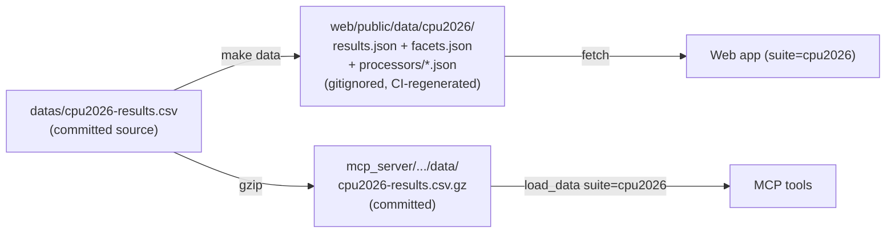

# Design: Add SPEC CPU2026 as a new benchmark suite

**Date:** 2026-06-19
**Status:** Approved — ready for implementation planning

## Summary

SPEC has published CPU2026 results as a downloadable CSV dump
(`https://www.spec.org/cgi-bin/osgresults?conf=cpu2026;op=dump;format=csvdump`).
This adds CPU2026 to spec-search as a new suite alongside the existing
`cpu2017` and `jbb2015` suites, surfacing CPU2026's full data including its
headline energy-efficiency metrics.

The work is **additive**: spec-search already has a multi-suite registry on
both backend (pipeline + MCP) and frontend. Adding CPU2026 means adding one
config entry to each registry plus committing the data files — the same shape
of change that introduced `jbb2015`.

## Context

The live CPU2026 dump (fetched 2026-06-19) is **272 KB / 279 data rows** with
four benchmark codes, identical in structure to CPU2017's speed/rate split:

| Code | Count | Label |
|------|-------|-------|
| `CINT2026` | 57 | Integer Per-Core |
| `CFP2026` | 55 | FP Per-Core |
| `CINT2026rate` | 84 | Integer Multi-Core |
| `CFP2026rate` | 83 | FP Multi-Core |

CPU2026's CSV columns are a **superset** of CPU2017's: every core column maps
1:1, and CPU2026 adds energy results, cache-level detail, compiler detail,
storage/filesystem, and provenance columns. Disclosure URLs point to
`/cpu2026/results/...`.

### Decisions locked during brainstorming

- **Field scope: full enrichment** — surface energy plus a curated set of
  cache/compiler/storage detail columns (not literally every new column; see
  Field Mapping for what is included vs. omitted).
- **Default suite: keep `cpu2017`** — CPU2026 is still sparse (279 rows vs.
  ~46K). Users land on CPU2017 and switch to CPU2026 via the existing selector.

## Architecture

CPU2026 slots into the existing registries — no new abstractions:

- **Pipeline** (`scripts/convert_csv.py`): the `SUITES` dict.
- **MCP loader** (`mcp_server/src/spec_search_mcp/data_loader.py`):
  `SUITE_CONFIGS` + `VALID_SUITES`.
- **MCP server** (`mcp_server/src/spec_search_mcp/server.py`):
  `BENCHMARK_LABELS`, `SORT_COLUMNS`, `instructions`.
- **Web** (`web/src/constants/suites.js`): the `SUITES` registry; the UI
  selector and comparison view auto-populate from it.

The "full enrichment" extras ride on the **existing** `extra_cols` /
`extraColumns` / `extra_facet_fields` machinery that `jbb2015` introduced for
`jvm` / `nodes` — no new mechanism is needed.

### Data flow (unchanged shape)

## Field mapping (full enrichment)

### Core — parity with CPU2017

| CSV column | JSON key | Type |
|------------|----------|------|
| `Benchmark` | `benchmark` | string |
| `Hardware Vendor` | `vendor` | string |
| `System` | `system` | string |
| `Peak Result` | `peakResult` | numeric |
| `Base Result` | `baseResult` | numeric |
| `# Cores` | `cores` | numeric |
| `# Chips` | `chips` | numeric |
| `# Enabled Threads Per Core` | `threadsPerCore` | numeric |
| `Processor` | `processor` | string |
| `Processor MHz` | `processorMhz` | numeric |
| `Memory` | `memory` | string |
| `Operating System` | `os` | string |
| `HW Avail` | `hwAvail` | string |
| `Test Date` | `testDate` | string |
| `Published` | `published` | string |
| `Disclosures` | `resultUrl` (extracted) | string |

URL extraction pattern: `re.compile(r'HREF="(/cpu2026/results/[^"]+\.html)"')`,
source column `Disclosures`.

### Enrichment — new in CPU2026

**Energy (numeric, sortable):**

| CSV column | JSON key |
|------------|----------|
| `Energy Peak Result` | `energyPeakResult` |
| `Energy Base Result` | `energyBaseResult` |

**Detail (string; shown in web table extra columns + comparison view):**

| CSV column | JSON key |
|------------|----------|
| `1st Level Cache` | `l1Cache` |
| `2nd Level Cache` | `l2Cache` |
| `3rd Level Cache` | `l3Cache` |
| `Compiler` | `compiler` |
| `Compiler Category` | `compilerCategory` |
| `Storage` | `storage` |
| `File System` | `fileSystem` |
| `SW Avail` | `swAvail` |

**New facet:** `compilerCategories` (sourced from `compilerCategory`;
low-cardinality: Vendor / Community).

### Deliberately omitted

`Other Cache`, `Base Pointer Size`, `Peak Pointer Size`, `CPU(s) Orderable`,
`License`, `Tested By`, `Test Sponsor`, `Updated`, and the numeric `Disclosure`
id — low filtering/comparison value, kept out to keep the comparison view
readable. Any can be added later with a one-line config change.

## Components touched

| Layer | File | Change |
|-------|------|--------|
| Pipeline | `scripts/convert_csv.py` | Add `SUITES["cpu2026"]`: `column_map` (core + enrichment), `numeric_fields` incl. `energyPeakResult`/`energyBaseResult`, `url_pattern` for `/cpu2026/`, `url_source_column="Disclosures"`, `extra_facet_fields={"compilerCategories": "compilerCategory"}` |
| MCP loader | `data_loader.py` | Add `SUITE_CONFIGS["cpu2026"]` (rename_map, numeric_cols incl. energy, url_column/url_pattern, extra_cols); add `"cpu2026"` to `VALID_SUITES`; add `CPU2026_URL_PATTERN` |
| MCP server | `server.py` | Add 4 `BENCHMARK_LABELS` (`CINT2026`, `CFP2026`, `CINT2026rate`, `CFP2026rate`); add `energy_peak`→`energyPeakResult` and `energy_base`→`energyBaseResult` to `SORT_COLUMNS` with a guard (`if sort_col not in df.columns: sort_col = "peakResult"`); update `instructions` to mention cpu2026 |
| Web | `web/src/constants/suites.js` | Add `SUITES.cpu2026` (name `SPEC CPU2026`, peak/base labels `Peak`/`Base`, `benchmarkLabels`, `extraColumns` [energy numeric + cache/compiler/storage strings], `extraComparisonFields`, `specBaseUrl`). `DEFAULT_SUITE` stays `cpu2017` |
| Data | `datas/cpu2026-results.csv` | Commit live dump (272 KB) |
| Data | `mcp_server/src/spec_search_mcp/data/cpu2026-results.csv.gz` | Commit gzip of the above |
| Build | `Makefile` | Add `web/public/data/cpu2026` to the `clean` target |
| Build | `.gitignore` | Add `web/public/data/cpu2026/` |

The web suite selector (`SUITE_IDS.map`) and comparison view consume the
registry directly — **no component code changes**, only the config entry.

## Error handling / edge cases

- **Trailing-whitespace / tab in headers** (`"Hardware Vendor\t"`,
  `"Processor "`, `"# Chips "`, `"Updated "`) — already stripped by both
  loaders (`df.columns.str.strip()` in the MCP loader, `{k.strip(): v}` in the
  pipeline). Verified against the live header.
- **`Peak Result = 0`** (base-only runs, e.g. the Apple M5 Pro row) — sorts to
  the bottom under the existing `peakResult` desc + `na_position="last"`.
  Acceptable; documented behavior.
- **Energy `0`** = not measured → normalized to `null` in the data layer
  (pipeline `null_if_zero` + MCP `mask`), so the web renders "—" via the
  existing `?? "—"` idiom and energy sorts unmeasured rows last. No frontend
  rendering change needed.
- **Cross-suite energy sort** — the `SORT_COLUMNS` guard falls back to
  `peakResult` when an `energy_*` sort is requested against a suite (cpu2017)
  that lacks those columns, preventing a pandas `KeyError`.
- **Magnitude difference** — CPU2026 ratios are small (≈3–9) vs. CPU2017
  SPECrate (hundreds). No code impact; charts auto-scale per suite.

## Testing

Follow the existing `jbb2015` test patterns:

- **Pipeline** (`tests/`): a small CPU2026 fixture asserting energy parsed as
  numeric, `/cpu2026/` result URL extracted, and the `compilerCategories` facet
  built.
- **MCP** (`mcp_server/tests/`): `suite="cpu2026"` loads; `search_benchmarks`
  returns enrichment fields; `energy_peak` sort works and falls back safely on
  cpu2017; benchmark labels resolve.
- **Web** (`web/src/__tests__/`): registry assertion that `cpu2026` exists with
  its `extraColumns`/`extraComparisonFields`.

`make test` (pipeline + MCP + web) and `make lint` must pass.

## Docs (kept in sync)

- `docs/data-refresh.md` — generalize to cover CPU2026 (`conf=cpu2026` dump URL
  and the per-suite gzip step).
- `docs/architecture.md` — note the cpu2026 suite.
- `docs/adr/ADR-008-cpu2026-suite.md` — short ADR recording the
  enrichment-field selection and energy-as-displayed-metric decision.
- `CHANGELOG` — add an entry.

## Out of scope (possible fast-follows)

- First-class energy **filtering** in MCP/web (min-energy filter, perf-per-watt
  derived column). Energy is mostly `0` in current data, so deferred.
- Surfacing the omitted detail columns (pointer size, provenance, etc.).
- Automated/scheduled refresh of the CPU2026 dump.
